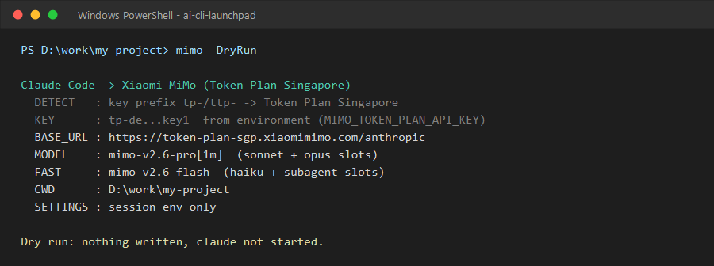
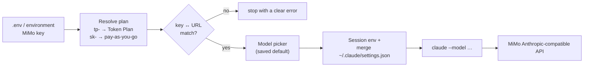

# ai-cli-launchpad

[](https://github.com/kumarlalitss166/ai-cli-launchpad/actions/workflows/ci.yml)
[](LICENSE)


**One command to run [Claude Code](https://docs.anthropic.com/en/docs/claude-code) on Xiaomi MiMo models** — correct endpoint, model slots and prompt caching set for you, with a model picker that remembers your choice.



## Why

Claude Code can talk to any Anthropic-compatible API, but pointing it at another provider by hand means juggling `ANTHROPIC_BASE_URL`, auth tokens, four model slots and cache settings — and getting one wrong gives you an unhelpful `400 token unavailable` or `401`.

This launcher:

- **Detects the right endpoint from your key** — `tp-`/`ttp-` → MiMo Token Plan, `sk-` → pay-as-you-go — and **blocks key/URL mismatches** before they reach the API.
- **Fills every model slot**: main model for Sonnet/Opus, fast model for Haiku, background and subagent calls.
- **Remembers your model** per machine (first run shows a menu; after that, Enter).
- **Merges, never clobbers** your Claude Code config: existing permissions, hooks, MCP servers and project trust stay; old files are backed up.
- **Keeps keys out of git** (`.env` is gitignored) and **never prints them in full**.

## Quick start

Requirements: PowerShell 5.1+ (Windows) or PowerShell 7+ (any OS), [Claude Code](https://docs.anthropic.com/en/docs/claude-code/setup), and a Xiaomi MiMo API key (Token Plan `tp-...` or pay-as-you-go `sk-...`).

```powershell
git clone https://github.com/kumarlalitss166/ai-cli-launchpad.git
cd ai-cli-launchpad/launchers/claude-code

Copy-Item env.example .env        # then put your key in .env
.\Start-ClaudeWithMiMo.ps1         # pick a model once; Claude Code starts
```

Downloaded a ZIP on Windows instead? Run `Get-ChildItem -Recurse *.ps1 | Unblock-File` once.

Launch from any project folder:

```powershell
cd D:\work\my-project
& "C:\path\to\ai-cli-launchpad\launchers\claude-code\Start-ClaudeWithMiMo.ps1"
```

Full guide, all options and troubleshooting: **[launchers/claude-code/README.md](launchers/claude-code/README.md)**

## Common options

| Command | What it does |
|---|---|
| `.\Start-ClaudeWithMiMo.ps1 -SelectModel` | Show the model menu again |
| `.\Start-ClaudeWithMiMo.ps1 -Model flash` | One-off model (aliases: `pro1m`, `pro`, `flash`) |
| `.\Start-ClaudeWithMiMo.ps1 -Plan TokenPlanAms` | Force an endpoint / region |
| `.\Start-ClaudeWithMiMo.ps1 -DryRun` | Print the resolved config; write nothing, start nothing |
| `.\Start-ClaudeWithMiMo.ps1 -NoSettingsWrite` | Session-only env; leave `~/.claude/settings.json` alone |
| `.\Configure-ClaudeWithMiMo.ps1` | One-time: make plain `claude` use MiMo everywhere |

## How it works



More detail: [docs/architecture.md](docs/architecture.md)

## Project layout

```text
launchers/claude-code/
  Start-ClaudeWithMiMo.ps1       daily launcher
  Configure-ClaudeWithMiMo.ps1   one-time global setup
  lib/Common.ps1                 .env, BOM-free writes, safe Claude config merge
  lib/MiMo.ps1                   endpoints, key detection, model catalog, env
  lib/ModelSelector.ps1          reusable model menu + saved defaults
tests/                           Pester 5 tests (107) — run on Windows PowerShell, pwsh, Linux in CI
docs/                            architecture, troubleshooting
```

## Development

```powershell
Install-Module Pester -MinimumVersion 5.5 -Scope CurrentUser -Force -SkipPublisherCheck
Install-Module PSScriptAnalyzer -Scope CurrentUser -Force

Invoke-Pester ./tests
Invoke-ScriptAnalyzer -Path ./launchers -Recurse -Settings ./PSScriptAnalyzerSettings.psd1
```

See [CONTRIBUTING.md](CONTRIBUTING.md). Security notes: [SECURITY.md](SECURITY.md).

## Roadmap

- [x] Claude Code + Xiaomi MiMo launcher (v0.1)
- [ ] `doctor` command (CLI installed, key present, endpoint reachable)
- [ ] bash/zsh launcher for macOS/Linux users without PowerShell
- [ ] More Anthropic-compatible providers via the same `lib/` pattern
- [ ] Publish to the PowerShell Gallery

## Disclaimer

Not affiliated with Anthropic or Xiaomi. Claude Code and MiMo are trademarks of their owners. You are responsible for your API usage and costs.

## License

[MIT](LICENSE) © 2026 Lalit Kumar
