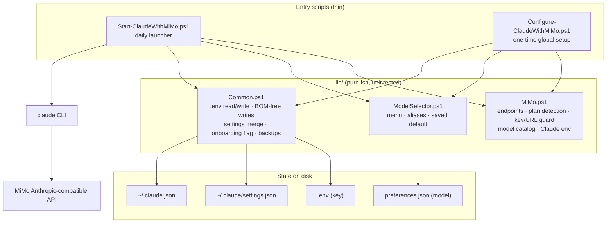
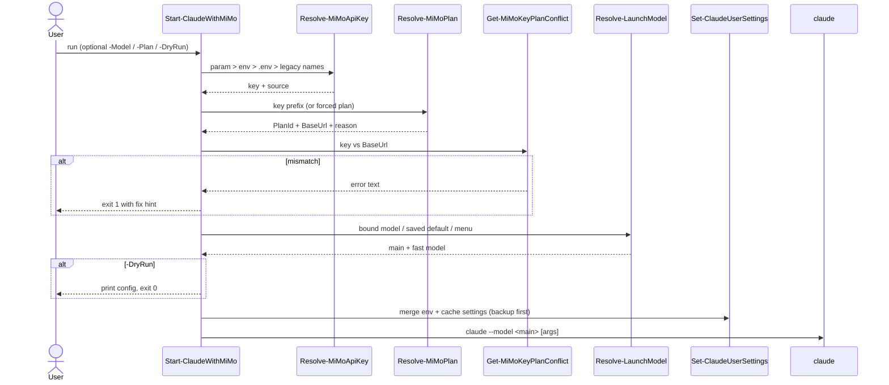

# Architecture

## Goal

Make "use Claude Code with provider X" a single command that is **safe to re-run**: no hand-edited env vars, no clobbered config, no leaked keys.

## Layers

**Rule:** decisions live in `lib/` functions that take inputs and return values (easy to test). Entry scripts only wire them together and print.

## Launch sequence

## Design decisions

| Decision | Why |
|---|---|
| Detect endpoint from key prefix | Token Plan and pay-as-you-go keys only work on their own URL; the mismatch error from the API does not say that |
| Refuse mismatches locally | Fails fast with an actionable message instead of a 400/401 |
| Merge `settings.json`, never overwrite | Users keep permissions, hooks, status line, other env vars |
| Edit `~/.claude.json` as text | It holds project trust and MCP servers; re-serializing risks changing it (PS 5.1 JSON quirks, depth limits) |
| BOM-free UTF-8 writes | Windows PowerShell 5.1 `-Encoding utf8` adds a BOM; Node's `JSON.parse` rejects it |
| Main vs fast model slots | Heavy reasoning on Pro, cheap background/subagent calls on Flash |
| Saved default per provider in `preferences.json` | Zero-prompt daily launches, one keypress to change |
| `-DryRun` | Safe to demo, debug and smoke-test in CI without a real key or `claude` installed |
| Honor `CLAUDE_CONFIG_DIR` | Matches Claude Code behaviour; also lets tests use a temp folder |

## Adding another provider

1. `lib/<Provider>.ps1` — endpoint(s), key resolution, conflict check, catalog, `Get-<Provider>ClaudeEnv`.
2. `Start-ClaudeWith<Provider>.ps1` — copy the MiMo launcher shape; call your lib.
3. `tests/<Provider>.Tests.ps1` — cover detection, conflicts, catalog, env.
